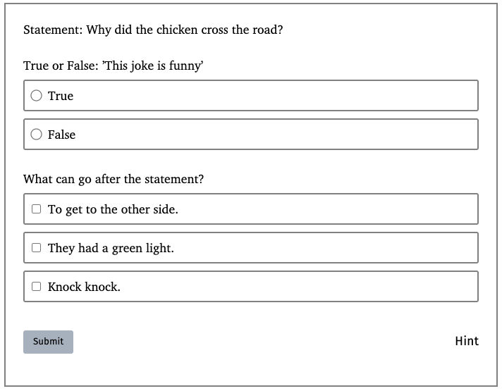
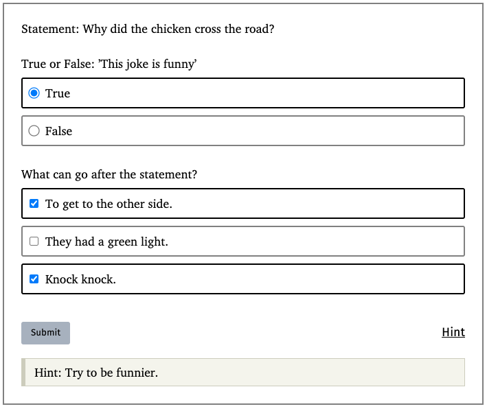
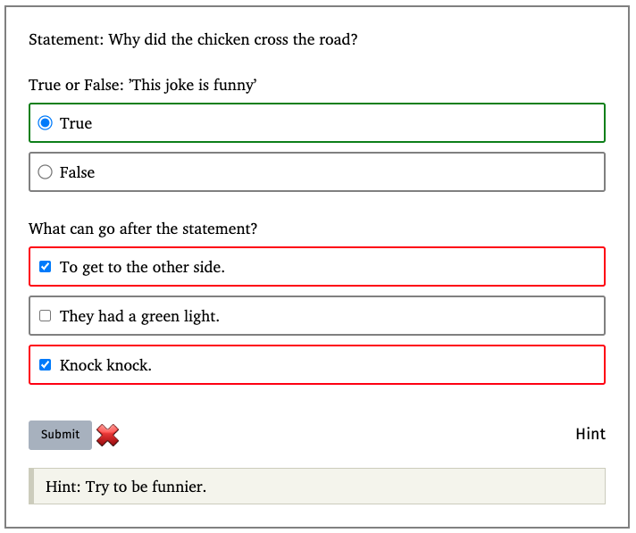
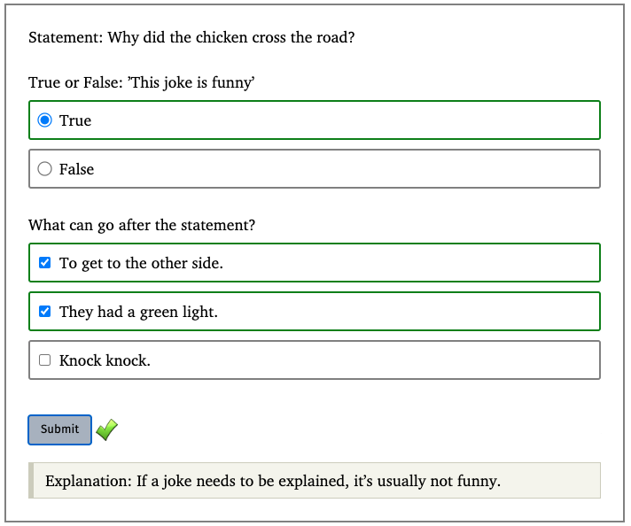

# scribble-question
Simple questions in Scribble for "check your understanding" type of questions.

## Supported Problem Types
"Questions" consists of a list of problems. Here are the problem types supported:
- Multiple-choice
- Multiple-select

## Examples

Questions can be written in the syntax below:
```rkt
@(question 
  "Statement: Why did the chicken cross the road?"
  (list (multiple-choice "True or False: 'This joke is funny'"
                         (list (option "True" #true)
                               (option "False" #false)))
        (multiple-select "What can go after the statement?"
                         (list (option "To get to the other side." #true)
                               (option "They had a green light." #true)
                               (option "Knock knock." #false))))
  "Hint: Try to be funnier."
  "Explanation: If a joke needs to be explained, it's usually not funny.")
```

Which renders to:


And you can select/check some option and view the Hint.


Questions can be incorrect if one of its problems are incorrect.


When submitted with all problems correct, it displays the explanation.
